

# **Resume Builder Laravel**

## **About Project**
It is a web application that allows users to create, read, update, and delete (CRUD) their resumes. The project would utilize the Laravel framework and include features such as form for users to input their resume information, and the ability to view, edit, and delete their resumes.
 

## **How To Run The Project**

 

### **Step 1: Install PHP and Web Server**
XAMPP is a free and open-source cross-platform web server. XAMPP is a software package that includes Apache, PHP, and MariaDB (a fork of MySQL). When you install XAMPP, you are installing all of these components at the same time. PHP is included in the package, so you do not need to install it separately.
- Download XAMPP from the Apache Friends website. ([Download XAMPP](https://www.apachefriends.org/download.html))
- Run the downloaded installer file.
- Choose the components you want to install (e.g. Apache, MySQL, PHP).
- Choose the installation location.
- Click "Install" to begin the installation process.

 

### **Step 2: Install Composer**
Composer is a dependency manager for PHP and is used to install Laravel and its dependencies. You can download Composer from the given link and install it according to the instructions provided. ([Download Composer](https://getcomposer.org/download/))

 

### **Step 3: Clone the Laravel project**
Clone the Laravel project from a repository or download it as a zip file and extract it to your machine.

#### **Copy GitHub repository link**

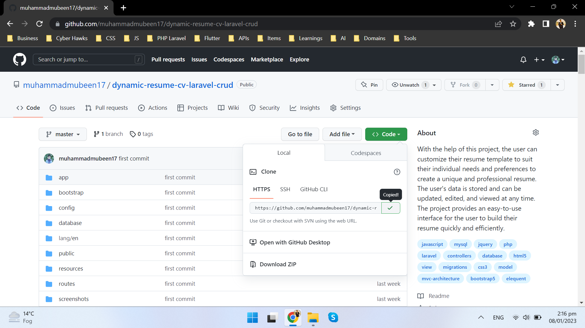

#### **Open Xampp/htdocs folder and open terminal**

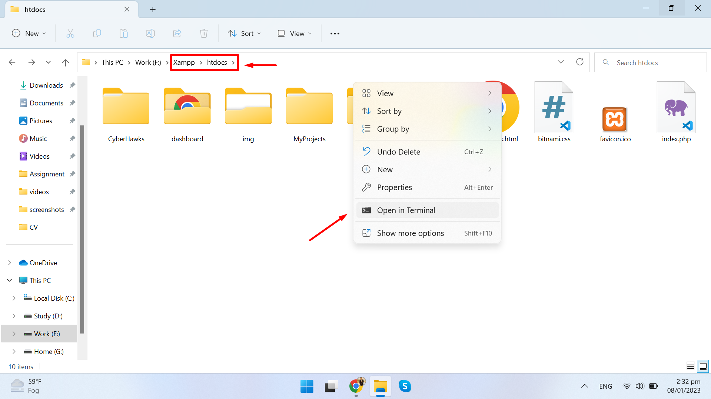

#### **Clone repository**

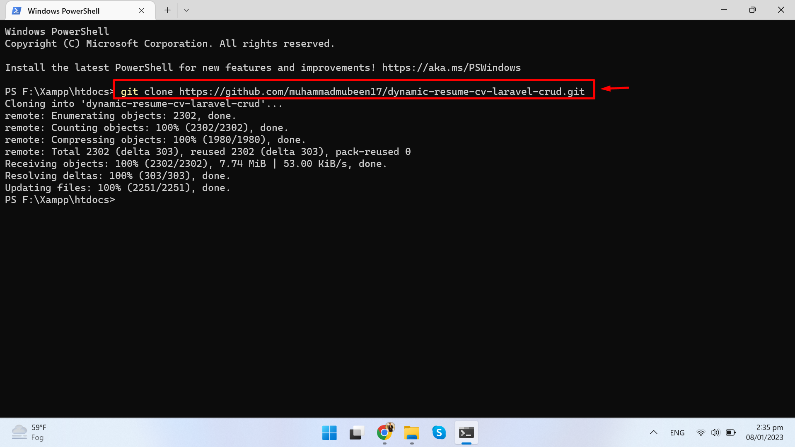

 

### **Step 4: Navigate to the Project directory**
Navigate to the root directory of your Laravel project and open terminal.

#### **Open Project directory**

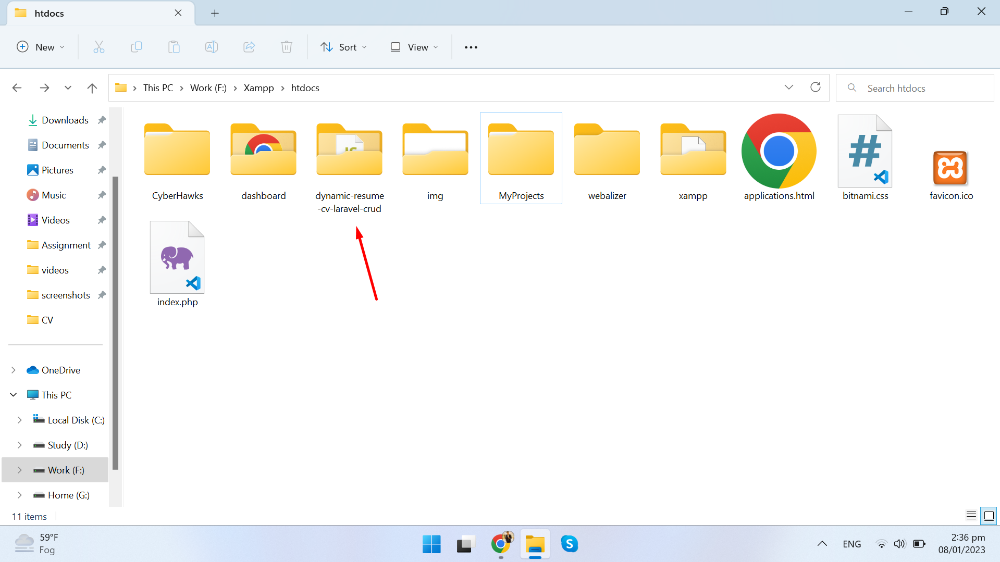

#### **Open terminal**

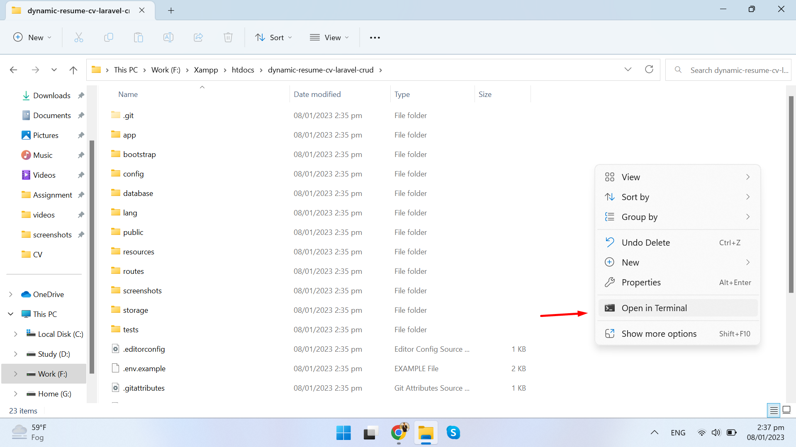

### **Step 5: Install required dependencies**
Run the following command to install the required dependencies:

    $ composer install

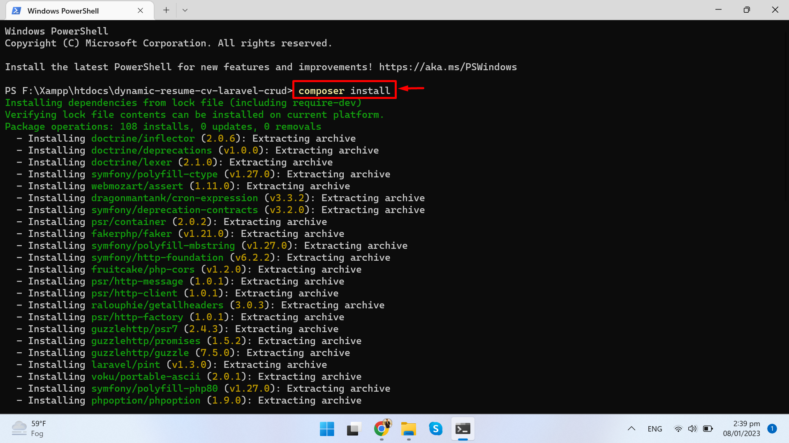

### **Step 6: Copy .env.example file**
Copy the .env.example file to a new file called .env.

    $ cp .env.example .env

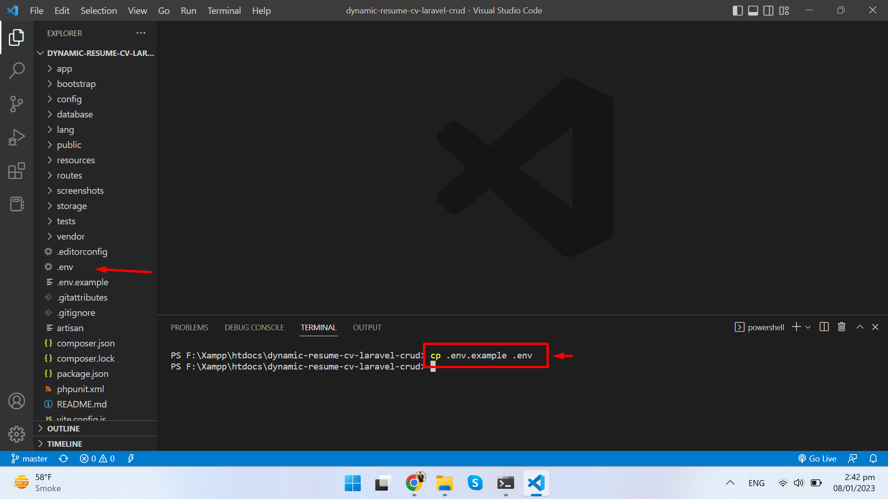

### **Step 7: Generate Application Key**
Run the following command to generate an application key:

    $ php artisan key:generate

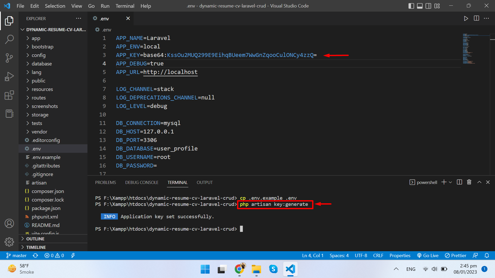

### **Step 8: Open XAMPP Control Panel and Run Services**
Open XAMPP Control Panel and start Apache and MySQL services.

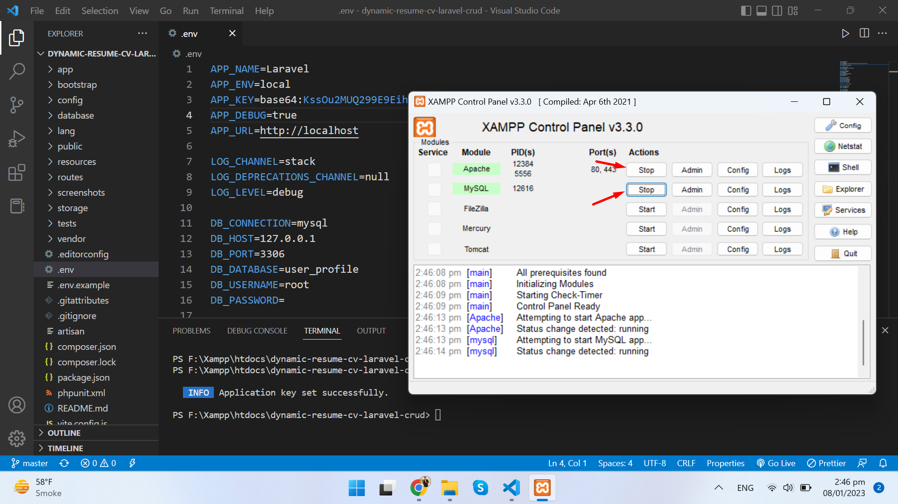

### **Step 9: Create Database and update the database connection settings**
Open phpMyAdmin and create a new database. In the .env file, update the database connection settings to match your local database setup.

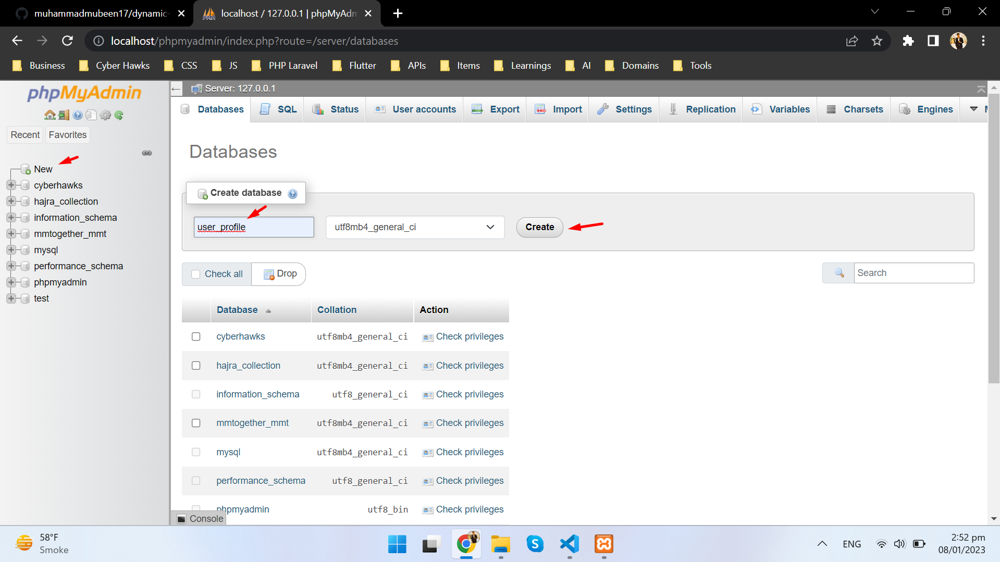

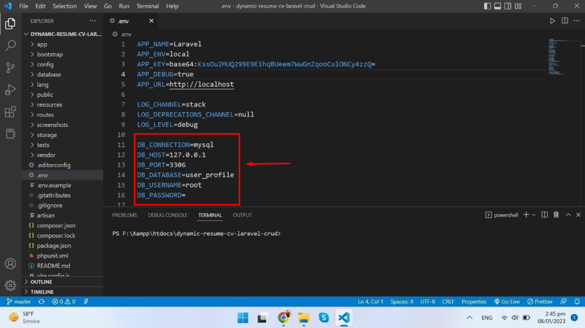

### **Step 10: Migrate all migrations**
Run the following command to migrate the database:

    $ php artisan migrate

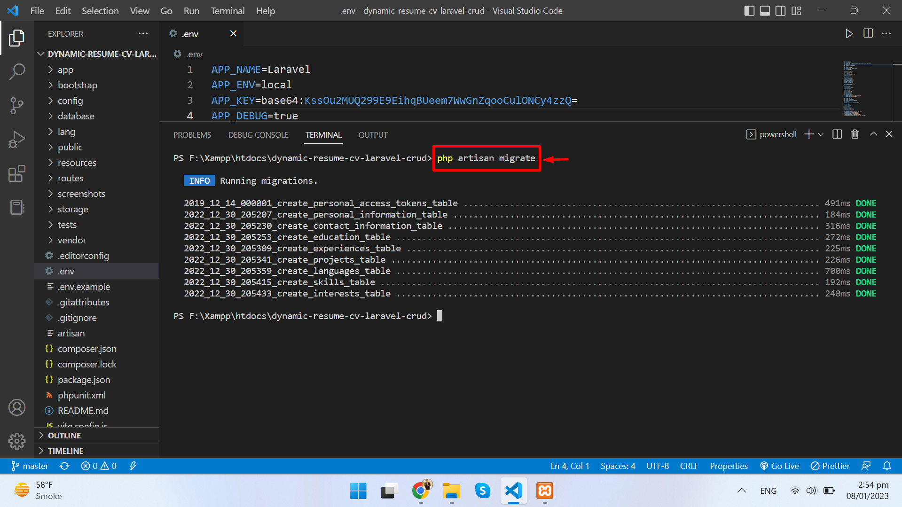

### **Step 11: Start Development Server**
Finally, start the development server by running the following command:

    $ php artisan serve

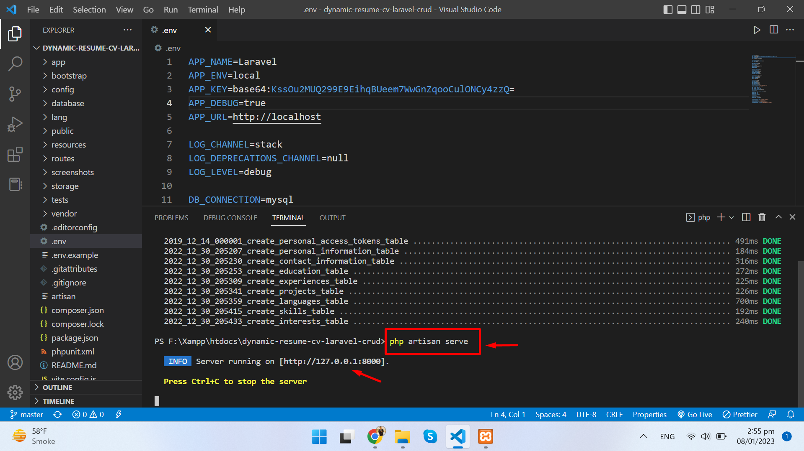

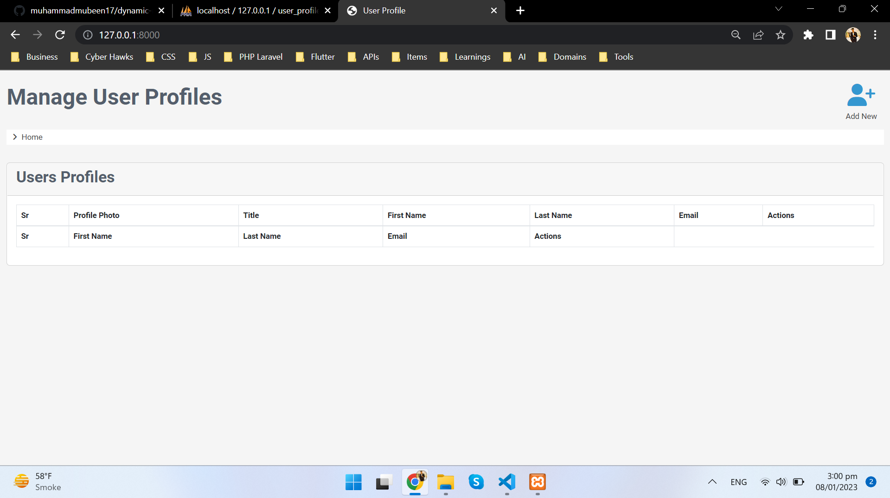

 

## **Here are some output images:**

### **Disply all Records**

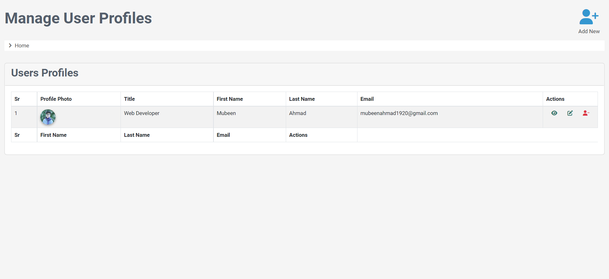

### **Create new Records**

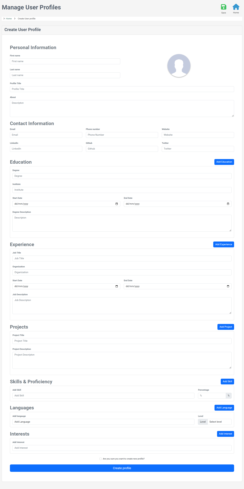

### **Edit all Records**

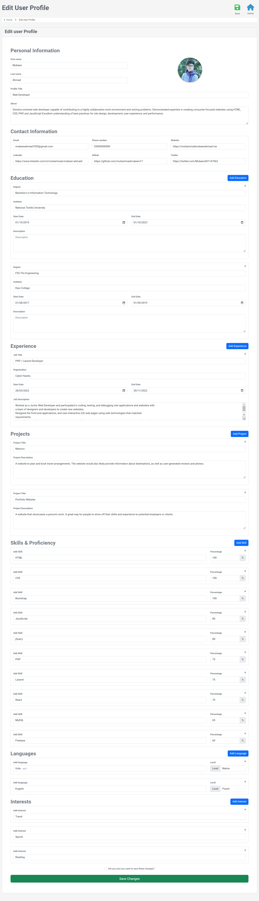

### **View Single Records**

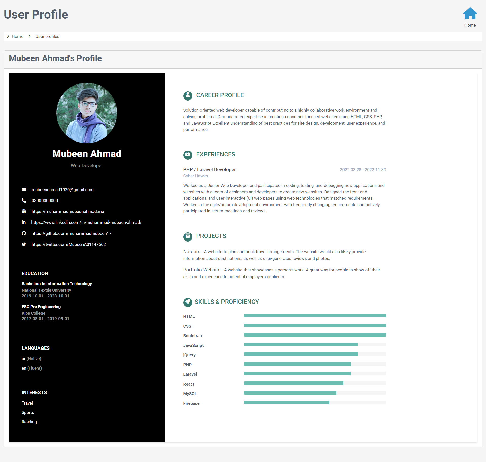

 

## **Show your support**

Give a ⭐ if you like this website!

